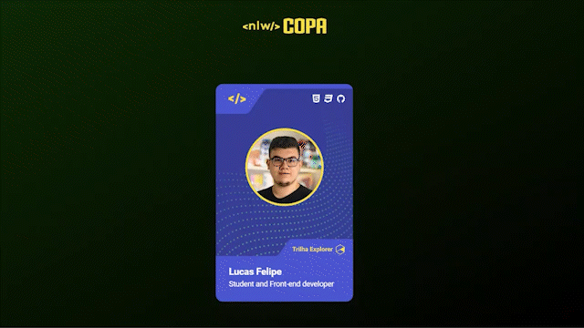

# Challenge

Este projeto nâo e um challenge da [Rocketseat](https://www.rocketseat.com.br/), entretanto achei bem interessante e acabei colocando com essa tag para que todos esses projetos fiquem junto. O projeto se consiste em criar um card (Figurinha) da NLW Copa (Evento organizaddo pela Rocketseat que por sinal será o ultimmo deste ano de 2022).

Video do desafio [aqui](https://www.youtube.com/watch?v=sswJisbD2CY&t=2500s).

Caso queira ver mais desafios, basta acessar meu perfil no [Github](https://github.com/LFeli) e utilizar o termo "Challenge". Ou basta clicar em [ver mais desafios](https://github.com/LFeli?tab=repositories&q=Challeng&type=&language=&sort=).

## Sumário 
- [Dúvidas](#dúvidas)
- [Tecnologias](#tecnologias)
- [Resultado final](#resultado-final)

## Dúvidas
### Como posso visualizar o projeto final?
Simples basta clicar aqui em [Visualizar projeto final](https://lfeli.github.io/Challenge-Rocketseat-fugurinha-copa/) que você já será redirecionado.  

### Qual editor de código você utiliza?
Atualmente estou utilizando o **Visual Studio Code**.

### Quais são suas configs do VS CODE?
Segue as configs abaixo:
```json
{
    "workbench.iconTheme": "material-icon-theme",
    "editor.wordWrap": "on",
    "workbench.colorTheme": "One Dark Pro Darker",
    "files.autoSave": "afterDelay",
    "editor.fontSize": 16,
    "window.zoomLevel": -1
}
```

### Como troco minhas configs no VS CODE? (Windows)
Basta abrir o VS CODE e utilizar o seguinte comando ```CTRL``` + ```SHIFT``` + ```P```. Apos isso abrir ```"Open user settings (JSON)"``` e colar as configs.

(opcional)  
Caso seu Visual Studio Code não fique com os temas aplicados e necessario baixar os plugins "material icon theme" e o "one dark pro"

## Tecnologias
- HTML 5
- CSS 3
- Javascript

## Resultado final
Abaixo um gif do arquivo final pronto. Ou veja pessoalmente clicando [aqui](https://lfeli.github.io/Challenge-Rocketseat-fugurinha-copa/).

